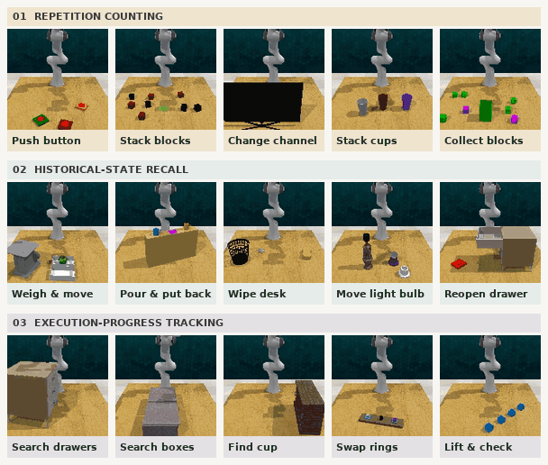

# HIDE & SEEK

**Benchmarking and Enhancing Skill-Level Memory for Partially Observable Robotic Manipulation**

Understanding hidden states can help robots make better decisions.

<p align="center">
  <a href="https://nanamma.github.io/HIDE-SEEK/"></a>
  <a href="https://arxiv.org/abs/2609.38886"></a>
  <a href="https://huggingface.co/papers/2609.38886"></a>
</p>

<p align="center">
  
</p>

## Overview

HIDE evaluates memory for hidden task states through **15 RLBench manipulation tasks**:

- **Repetition counting** — remember how many times an action has been completed.
- **Historical-state recall** — retain earlier evidence that is no longer visible.
- **Execution-progress tracking** — distinguish completed steps from what remains.

We study three complementary mechanisms: Windowed Context Memory, Persistent Anchor Memory, and Stage-Counter Memory.

## Results

SEEK achieves **62.9% average success on HIDE**, **11.7 percentage points** above SAM2Act+, the strongest evaluated baseline on average. Real-world experiments compare SEEK with SAM2Act+ and π₀.₅, and cover button pressing, cup stacking, desk cleaning, and hidden-object search. SEEK achieves 89% mean success across the four real-world tasks, compared with 47% for SAM2Act+ and 13% for π₀.₅.

## Release status

Code and data are being prepared.

## Citation

```bibtex
@misc{shi2026hide,
  title = {Benchmarking and Enhancing Skill-Level Memory for Partially Observable Robotic Manipulation},
  author = {Yansong Shi and Jiange Yang and Xijie Yang and Shaowei Zhang and Yuhan Zhu and Tao Lu and Limin Wang},
  year = {2026},
  eprint = {2609.38886},
  archivePrefix = {arXiv},
  primaryClass = {cs.RO},
  url = {https://arxiv.org/abs/2609.38886}
}
```
